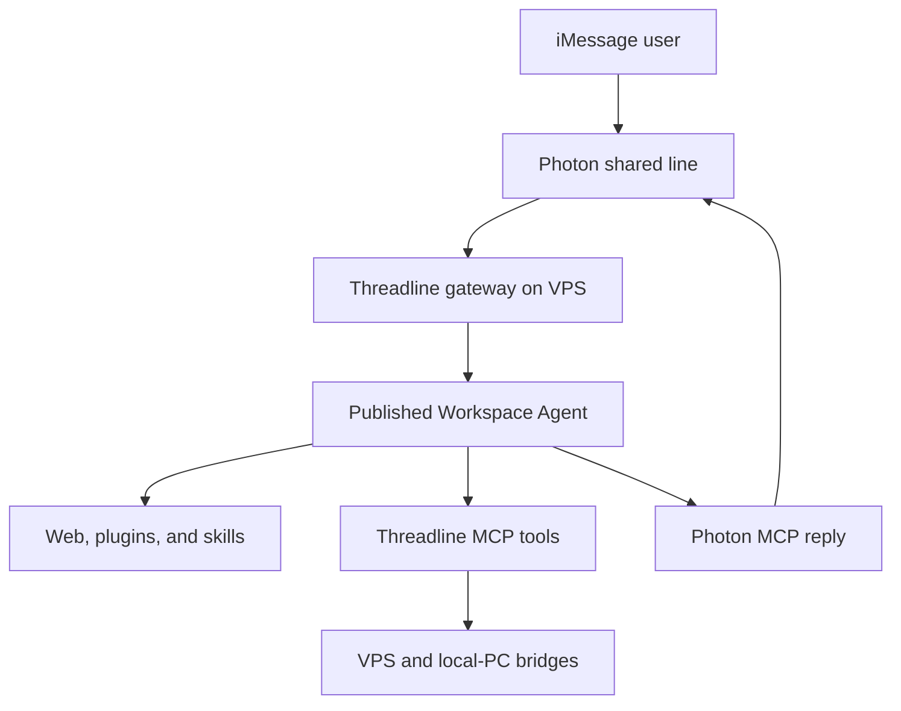

# Threadline

Threadline is a private iMessage gateway for a hosted ChatGPT Work agent and trusted execution backends on your VPS and personal computers.

The default experience is simple: send an iMessage and receive a response from a published Workspace Agent with its configured web access, plugins, skills, instructions, and approvals. Slash commands create sessions or route work to explicitly connected machines.

> Status: architecture and implementation planning.

## Architecture

Only the gateway owns the Photon/Spectrum connection, so the system needs one shared iMessage line. The hosted Workspace Agent is the default brain. The VPS and local PC are not implicitly accessible; each exposes a small, authenticated tool surface that the agent may use under explicit policy.

## Proposed commands

| Command | Purpose |
| --- | --- |
| `/new` | Start a fresh Threadline session and rotate its conversation mapping. |
| `/work` | Use the hosted Workspace Agent as the active target. |
| `/vps` | Select the approved VPS execution backend. |
| `/local [name]` | Select an approved local-computer backend. |
| `/model [name]` | Select a model for a Codex app-server session; not supported by Workspace Agent triggers. |
| `/reasoning [level]` | Select reasoning effort for a Codex app-server session; not supported by Workspace Agent triggers. |
| `/status` | Show the active target, session, and reachable backends. |
| `/help` | Show available commands without exposing sensitive configuration. |

Plain messages go to `/work` unless the user has explicitly selected another target.

## Core components

- **Gateway:** Receives Spectrum events, authenticates the sender, deduplicates messages, parses commands, maintains routing state, and triggers the selected agent runtime.
- **Workspace Agent:** Runs in ChatGPT's hosted environment with saved instructions, plugins, skills, app connections, and approval policy.
- **Photon MCP server:** Lets the Workspace Agent read the permitted thread and send exactly one reply to the server-bound Photon space.
- **Host bridge:** Exposes narrowly scoped tools for approved work on a VPS or local computer. Local connectivity should use Tailscale or another private authenticated network.
- **Optional Codex app-server adapter:** Provides persistent Codex threads, streamed events, and per-session model or reasoning controls when those features are needed.
- **State store:** Tracks message idempotency, Photon spaces, Threadline sessions, Workspace Agent conversation keys, selected targets, and backend health.

## Safety model

- Allowlist senders and bind Photon destinations server-side.
- Never accept a reply destination or backend address from untrusted message text.
- Give every MCP tool and host bridge the minimum required permissions.
- Keep destructive or externally visible actions approval-gated.
- Store access tokens outside the repository and redact secrets from logs.
- Use the Photon message ID as the idempotency key for every inbound event.
- Log routing decisions and tool calls without retaining unnecessary message content.
- Treat attachments and message content as untrusted input.

## MVP

The first usable release will support one owner, one Photon line, text messages, persistent hosted-agent conversations, `/new`, `/work`, `/status`, and exactly-once replies through Photon MCP. VPS and local-PC execution are added after the hosted path is reliable.

See [docs/PLAN.md](docs/PLAN.md) for the implementation plan, boundaries, and acceptance criteria.
See [docs/PHASE-0.md](docs/PHASE-0.md) for the Phase 0 feasibility record (architectural-spine verification, assumptions table, and go/no-go status).

## License

Private and unlicensed until a distribution decision is made.
